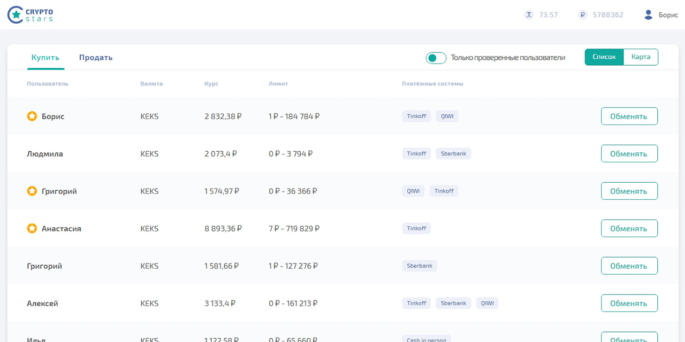

# Проект «Cryptostars» от [HTML Academy](https://htmlacademy.ru/)

Криптобиржа Cryptostars — сервис покупки криптовалюты KEKS онлайн и за наличный расчёт.

Программирование: [Андрей Грачев](https://github.com/andreysgra/)

[Демо проекта](https://andreysgra.github.io/crypto-stars/)

[Техническое задание](Specification.md)

## Используемый стек

JavaScript (ES6), ES Modules.

---

## Как использовать

`npm install` - установка зависимостей.

`npm start` - сборка проекта в режиме разработки и запуск локального сервера.

`npm run lint` - запуск теста на соответствие правилам ESLint.
